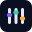

# Nightfall



**Lighting control, show programming, and 3D visualization.**

Nightfall is a modern, open-source DMX lighting controller built for programming and running live or timecoded shows.

Patch fixtures, create looks in the programmer, build cues and sequences, and arrange playback on a timeline—all in a customizable panel workspace.

[Website](https://nightfall.live) · [Downloads](https://nightfall.live/downloads) · [User guide](docs/src/SUMMARY.md) · [Contributing](CONTRIBUTING.md)

## What you can do

- **Patch and visualize fixtures.** Manage fixture profiles and DMX addresses, position lights in the 3D visualizer, and inspect channel output.
- **Program looks and effects.** Work with fixture groups, cues, sequences, reusable blueprints, and effects.
- **Build and play shows.** Bind sources to clips, trigger them or arrange them on timelines.
- **Connect your equipment.** Use Art-Net, sACN, and supported USB DMX outputs, with MIDI and OSC inputs for control.
- **Your workflow, your workspace.** Build and save layouts with dockable panels.

Nightfall is in active development. Try out the [in-browser demo](https://nightfall.live/demo) or Check the downloads page for available builds and release information.

## Get started

1. Get a build for your platform from [nightfall.live/downloads](https://nightfall.live/downloads).
2. Launch Nightfall and create a new showfile or open an existing one.
3. Open the command palette using the search button in the top toolbar, or **Ctrl+Shift+P** (**Cmd+Shift+P** on macOS), to find panels and actions.
4. Use the [user guide](docs/src/SUMMARY.md) to learn patching, programming, and playback. The Properties panel follows the active panel, so select the item you want to edit first.

You can explore programming and the visualizer without connecting lighting hardware. Configure hardware transports in the **I/O Transports** panel when you are ready to use physical outputs.

### Windows: uDMX devices

For a supported uDMX device to be discoverable on Windows, set it to use the WinUSB driver with [Zadig](https://zadig.akeo.ie/).

## Build from source

See [CONTRIBUTING.md](CONTRIBUTING.md#getting-started) for platform prerequisites, Rust and Node setup, generated web assets, and validation commands.

After completing that setup, run the backend and frontend in separate terminals:

```sh
cargo run
```

```sh
npm run dev
```

Open the local URL printed by Vite. The development backend defaults to port 3030 and the frontend to 3031; a worktree's `.env` can select another port pair.

The engine lives in [`crates/`](crates/), the SolidJS interface in [`webui/`](webui/), and the manual and design documents in [`docs/`](docs/).

## Feedback and contributions

Found a bug or have an idea? [Open an issue](https://github.com/stewartadam/nightfall-lightdesk/issues). Include your Nightfall version, operating system, and steps to reproduce the problem; screenshots and a minimal example showfile can help.

Code and documentation contributions are welcome. Read the [contribution guide](CONTRIBUTING.md) for development checks and the Developer Certificate of Origin. Sign off your commits with `git commit -s`.

## License

Nightfall is licensed under the [Mozilla Public License 2.0](LICENSE). Bundled third-party components and assets retain their respective licenses and notices.
